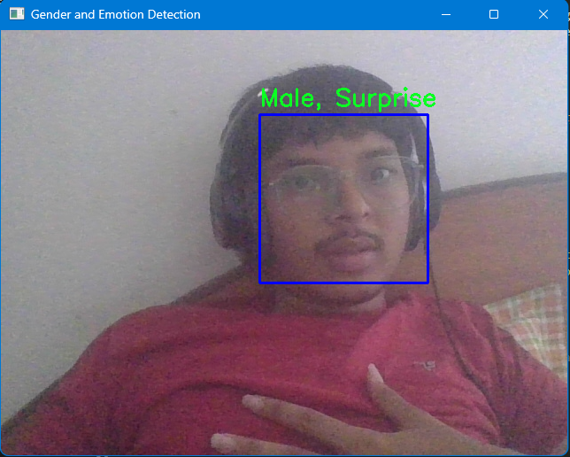

# Gender and Emotion Detection Program

## Overview
This program implements a real-time gender and emotion detection system using a webcam feed. It utilizes a pre-trained VGG16 model with custom layers for gender and emotion classification. The program detects faces in the video stream and predicts the gender and emotion for each detected face.

## Dependencies
- OpenCV (cv2)
- NumPy
- TensorFlow
- Keras

## Model Architecture
The model is based on the VGG16 architecture with the following modifications:
1. VGG16 base model (pre-trained on ImageNet, without top layers)
2. Global Average Pooling
3. Dense layer with 1024 units and ReLU activation
4. Two output layers:
   - Gender output: 2 units with softmax activation
   - Emotion output: 7 units with softmax activation

## Labels
- Gender labels: ['Male', 'Female']
- Emotion labels: ['Angry', 'Disgust', 'Fear', 'Happy', 'Sad', 'Surprise', 'Neutral']

## Face Detection
The program uses OpenCV's Haar Cascade classifier for face detection.

## Main Program Flow
1. Load the pre-trained VGG16 model and add custom layers
2. Define the final model with gender and emotion outputs
3. Load the face detection cascade classifier
4. Start video capture from the default camera
5. For each frame:
   - Convert the frame to grayscale
   - Detect faces in the frame
   - For each detected face:
     - Preprocess the face image
     - Predict gender and emotion
     - Draw bounding box and label on the frame
   - Display the processed frame
   - Check for 'q' key press to quit

## Usage
1. Ensure all dependencies are installed
2. Run the script:
   ```
   python gender_emotion_detection.py
   ```
   
3. Press 'q' to quit the program

## Note
The current implementation assumes that you have trained the model and saved the weights. You need to uncomment and modify the following line with the path to your trained weights:
```python
# model.load_weights('path_to_your_trained_weights.h5')
```

## Potential Improvements
1. Implement model training and weight saving
2. Add command-line arguments for camera selection and model path
3. Implement error handling for camera access and model loading
4. Add functionality to save processed video or screenshots
5. Optimize for performance on different hardware configurations

## Ethical Considerations
When using this program, be mindful of privacy concerns and obtain necessary permissions when capturing and analyzing video of individuals. The accuracy of gender and emotion predictions may vary and should not be used for critical decision-making without proper validation.
